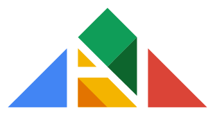
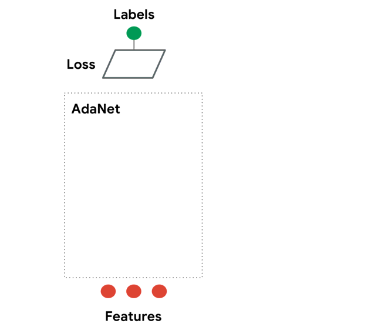

# AdaNet

[](https://badge.fury.io/py/adanet)
[](https://github.com/tensorflow/adanet/blob/master/LICENSE)



**AdaNet** is a lightweight and scalable TensorFlow AutoML framework for training and deploying adaptive neural networks using the *AdaNet* algorithm [[Cortes et al. ICML 2017](https://arxiv.org/abs/1607.01097)]. *AdaNet* combines several learned subnetworks in order to mitigate the complexity inherent in designing effective neural networks.



This is not an official Google product.

## Getting Started

To get you started:

- [Tutorials: for understanding the AdaNet algorithm and learning to use this package](./adanet/examples/tutorials)

## Requirements

Requires [Python](https://www.python.org/) 2.7, 3.4, 3.5, or 3.6.

`adanet` depends on bug fixes and enhancements not present in TensorFlow releases prior to 1.7. You must install or upgrade your TensorFlow package to at least 1.7:

```shell
$ pip install "tensorflow>=1.7.0"
```

## Installing with Pip

You can use the [pip package manager](https://pip.pypa.io/en/stable/installing/) to install the official `adanet` package from [PyPi](https://pypi.org/project/adanet/):

```shell
$ pip install adanet
```

## Installing from source

To install from source first you'll need to install `bazel` following their [installation instructions](https://docs.bazel.build/versions/master/install.html).

Next clone `adanet` and `cd` into its root directory:

```shell
$ git clone https://github.com/tensorflow/adanet && cd adanet
```

From the `adanet` root directory run the tests:

```shell
$ cd adanet
$ bazel test -c opt //...
```

Once you have verified that everything works well, install `adanet` as a [ pip package ](./adanet/pip_package/PIP.md).

You are now ready to experiment with `adanet`.

```python
import adanet
```

## License

AdaNet is released under the [Apache License 2.0](LICENSE).
